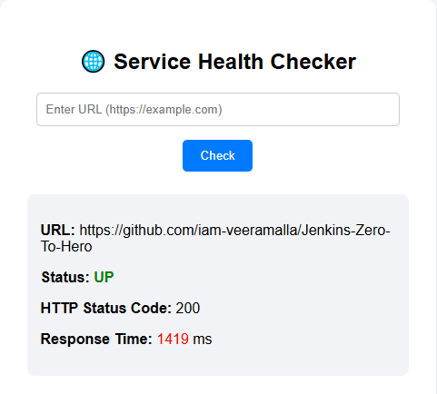

# 🌐 Service Health Checker & Latency Viewer

A simple, clean, and production-style Spring Boot web application that checks the health and response time (latency) of any given URL.

This project simulates real-world **DevOps monitoring tools** and is designed to be **CI/CD pipeline ready**.

---

## 📸 Project Screenshot



---

## 🎯 Objective

The goal of this project is to:

- Monitor service availability (UP/DOWN)
- Fetch HTTP status codes
- Measure response time (latency)
- Demonstrate backend + UI integration
- Prepare application for DevOps practices like Docker, Jenkins, and AWS deployment

---

## 🛠️ Tech Stack

| Layer        | Technology |
|-------------|-----------|
| Backend     | Spring Boot (Java 21) |
| Frontend    | Thymeleaf |
| Build Tool  | Maven |
| HTTP Client | RestTemplate / WebClient |
| Database    | ❌ Not Used |

---

## ⚙️ Features

✅ Check if a service is **UP or DOWN**  
✅ Display **HTTP Status Code** (200, 404, 500, etc.)  
✅ Measure **Response Time (ms)**  
✅ Clean and minimal UI  
✅ Color indicators:
- 🟢 Green → UP  
- 🔴 Red → DOWN  

---

## 🔄 Application Flow

1. User opens homepage (`/`)
2. Enters a URL (e.g., https://google.com)
3. Clicks **Check**
4. Backend:
   - Sends HTTP request
   - Measures response time
   - Determines status
5. Result displayed on UI

---


---

## 🧠 Core Logic

### 🔹 HealthResponse Model
Stores:
- URL
- Status (UP/DOWN)
- Status Code
- Response Time

---

### 🔹 Service Layer

- Sends HTTP request using `RestTemplate`
- Measures time using `System.currentTimeMillis()`
- Handles success & failure scenarios

---

### 🔹 Controller

- `GET /` → Loads UI  
- `POST /check` → Processes URL input  

---

## ❗ Error Handling

- Invalid URL → Shows error message  
- Unreachable service → Status = DOWN  
- Prevents application crash  

---

## 🚀 Getting Started

### 🔧 Prerequisites

- Java 21
- Maven

---

### ▶️ Run Locally

```bash
git clone https://github.com/your-username/your-repo-name.git
cd your-repo-name

mvn clean install
mvn spring-boot:run
```
### Open in browser:

http://localhost:8080
